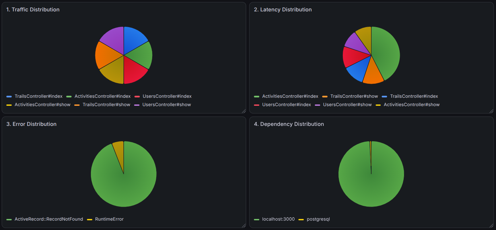
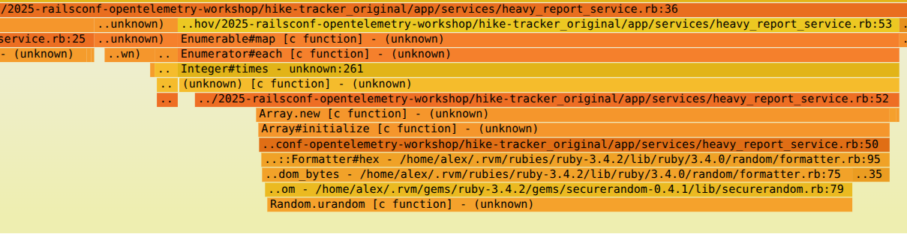

# Rails App Observability

## OpenTelemetry

* [Original repo: 2025-railsconf-opentelemetry-workshop](https://github.com/kaylareopelle/2025-railsconf-opentelemetry-workshop)
* [Video](https://www.youtube.com/watch?v=E_rKGBN_caQ&ab_channel=Confreaks)

### Setup

Generate license key for free account from [NewRelic](https://one.eu.newrelic.com) :
```sh
# https://one.eu.newrelic.com => User Profile => API Keys => Create key (based on Ingest License Key)
```

and set it here:
```sh
# config/initializers/opentelemetry.rb
ENV['NEW_RELIC_LICENSE_KEY'] = 'eu01x03...'
```

Run app:
```sh

cd hike-tracker_original

# Tab 1
rvm use 3.4.2
bundle
rails db:create
rails db:migrate
rails db:seed
rails s

# Tab 2
script/traffic.sh
```

### New Relic

Check New Relic Dashboard: `APM` / `Traces` / `Log` or run `NRQL`:
```sql
-- Overall traffic (is system alive?)
FROM Span SELECT rate(count(*), 1 minute) SINCE 30 minutes ago TIMESERIES

-- Latency (average response time): P95 latency (real user experience)
FROM Span SELECT percentile(duration.ms, 95) SINCE 30 minutes ago TIMESERIES

-- Slowest operations: “Where is time going?” (breakdown of latency): middleware cost, DB cost, external calls, controller cost
FROM Span SELECT average(duration.ms) FACET name SINCE 30 minutes ago LIMIT 10

-- Error rate: Top errors
FROM Span SELECT count(*) WHERE error.message IS NOT NULL FACET error.message SINCE 30 days ago LIMIT 10

-- Host-level & service-level breakdown: Service breakdown (web vs worker vs cron)
FROM Span SELECT rate(count(*), 1 minute) FACET process.command SINCE 30 minutes ago

-- DB performance (if ActiveRecord is instrumented): Slow database queries
FROM Span SELECT average(duration.ms) WHERE db.statement IS NOT NULL FACET db.statement SINCE 30 minutes ago LIMIT 10
```

## Grafana

### Setup

```sh
# Create files:
# config/otel-collector.yaml
# config/otel-prometheus.yaml
# config/otel-tempo.yml
# docker-compose.yml

# Create folders
mkdir otel-data tempo-data
chmod 777 otel-data tempo-data
ls -ld otel-data tempo-data
# =>
  # drwxrwxrwx 2 me me 4096 jul  2 19:59 otel-data
  # drwxrwxrwx 2 me me 4096 jul  2 19:59 tempo-data

# Connections => Add => Prometheus => URL: http://prometheus:9090
# Connections => Add => Loki => URL: http://loki:3100
# Connections => Add => Pyroscope => URL: http://pyroscope:4040
# Connections => Add => Tempo => URL: http://tempo:3200 | Connect traces to Loki, Prometheus, Pyroscope (CPU)
```

### Run

```sh
# This is only for development demo becuause each Docker restart refresh & remove old data & configs
# For production, use separate server with observability tools like here: docker-compose.prod.yml
docker compose up

# Add to config/initializers/opentelemetry.rb:
# ENV["OTEL_EXPORTER_OTLP_ENDPOINT"] = "http://localhost:4318"
# ENV["OTEL_EXPORTER_OTLP_PROTOCOL"] = "http/protobuf"
rails s

# Open
# App http://localhost:3000

# Grafana UI http://localhost:3333/login
# admin/admin

# OTel Collector http://localhost:8889/metrics
# Prometheus UI http://localhost:9090
# Loki http://localhost:3100/metrics
# Pyroscope http://localhost:4040
```

# Queries

Import into Grafana four Prometheus essentail [Pie Charts panels](docs/application_state_grafana_dashboard.yml) as `Application State` Dashboard or add it manually:

```sql
-- 1. Traffic Distribution

topk(
  10,
  sum by (controller_action) (
    increase(
      http_server_request_duration_milliseconds_count{
        exported_job="hike-tracker"
      }[$__range]
    )
  )
)

-- 2. Latency Distribution

topk(
  10,
  sum by (controller_action) (
    increase(
      http_server_request_duration_milliseconds_sum{
        exported_job="hike-tracker"
      }[$__range]
    )
  )
)

-- OR with Tempo
-- {} | quantile_over_time(span:duration, 0.95) by(name)
-- { span.db.statement != nil } | quantile_over_time(span:duration, 0.95) by(span.db.statement)

-- 3. Error Distribution

topk(
  10,
  sum by (exception_type) (
    increase(
      application_exceptions_total{
        exported_job="hike-tracker"
      }[$__range]
    )
  )
)
-- Impove Label UI: Panel → Edit → Field → Standard options → Display name: ${__field.labels.exception_type}

-- 4. Dependency Distribution

-- To exclude our service add filter by span_kind="SPAN_KIND_CLIENT"
topk(
  10,
  sum by (dependency) (
    increase(
      traces_span_metrics_duration_milliseconds_sum{
        dependency!=""
      }[$__range]
    )
  )
)
```



### Measuring Ruby code

To measure the bottleneck at Ruby services, we can use a simple tool like [rbspy](https://rbspy.github.io/):
```sh
cargo install rbspy

# Enable profiling if it is disabled
cat /proc/sys/kernel/yama/ptrace_scope
sudo sysctl kernel.yama.ptrace_scope=0
cat /proc/sys/kernel/yama/ptrace_scope

# Measure Rails
rails s
ps aux | grep puma
rbspy record --pid 1523583
# Open flamegraph.svg in the Browser

# Measure simple Ruby script
rbspy record -- ruby app/services/heavy_report_service.rb

# Disable profiling (set it back)
cat /proc/sys/kernel/yama/ptrace_scope
sudo sysctl kernel.yama.ptrace_scope=1
cat /proc/sys/kernel/yama/ptrace_scope
```



### Traces gathering

`OTel` gather traces and spans across multiple services. When one request calls another one, it adds a [W3C trace-context](https://www.w3.org/TR/trace-context). Then other services with the same `OTel` settings get it from the request and propagates to the next service call.

```rb
class ActivitiesController < ApplicationController
  #...
  def show
    Rails.logger.info(request.headers["traceparent"]) # in case of request from the initial service
    span = OpenTelemetry::Trace.current_span
    Rails.logger.info 'TraceID ---------------------------------------------------------'
    Rails.logger.info(trace_id: span.context.hex_trace_id, span_id: span.context.hex_span_id)
    # ...
```

### RCA

RCA stands for Root Cause Analysis, it's the process of finding the underlying reason why an incident occurred, rather than just fixing the immediate symptom.

```sh
# Example
Issue: Users cannot log in.
  => Symptom: HTTP 500
    => Immediate cause: Database connection failed.
      => Root cause: A firewall rule deployed at 14:32 blocked connections from the application to PostgreSQL.
```

The RCA is about answering "Why did this happen?", not just "What failed?".

Typical RCA process:
```
Detect the incident
  Alert fires.
  Users report a problem.

Assess the impact
  Which services?
  How many users?
  How long?

Investigate
  Metrics (Prometheus)
  Logs (Loki)
  Traces (Tempo)

Identify the root cause
  Deployment?
  Infrastructure?
  Code bug?
  Configuration?
  External dependency?

Resolve
  Roll back
  Fix configuration
  Patch code

Prevent recurrence
  Add tests
  Improve monitoring
  Add alerts
  Update runbooks
```

```sh
# Example
Imagine your "Application State" dashboard shows:
🔴 Request Outcome: Errors increased from 0.1% to 15%.
🔴 Error Distribution: PG::ConnectionBad is now the top exception.
🟡 Latency Distribution: OrdersController#create latency has increased dramatically.
🔵 Dependency Distribution: PostgreSQL accounts for 80% of request time.

Steps

1. Click the PG::ConnectionBad pie slice.
2. Open the corresponding traces in Tempo.
3. See repeated database connection failures.
4. Check Loki logs and find: connection refused
5. Check Kubernetes events and discover the PostgreSQL pod restarted after a failed configuration change.

Root cause: An incorrect PostgreSQL configuration deployed at 14:32 caused the database to reject new client connections.
Action items:
  Add configuration validation before deployment.
  Add an alert for failed PostgreSQL readiness probes.
  Test configuration changes in staging.
```

"We restarted the service."
=>
"Why did we need to restart it in the first place, and how can we prevent this from happening again?"

### Videos

* [Server Monitoring // Prometheus and Grafana Tutorial](https://www.youtube.com/watch?v=9TJx7QTrTyo)

### Online Tools

* [Grafana dashboards](https://grafana.com/grafana/dashboards)
* [OpenTelemetry Config Generator](https://tracekit.dev/tools/otel-config-generator)
* [Trace Visualizer](https://tracekit.dev/tools/trace-visualizer)
* [JSON Crack](https://jsoncrack.com/editor)

### Other tools

* [Grafana Alloy](https://github.com/grafana/alloy) - modern native Grafana substitution for [opentelemetry-collector](https://github.com/open-telemetry/opentelemetry-collector).
